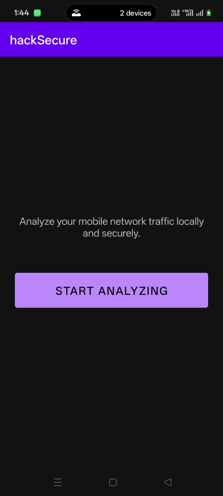
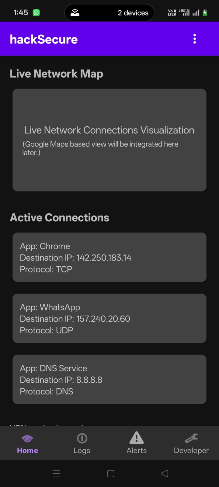
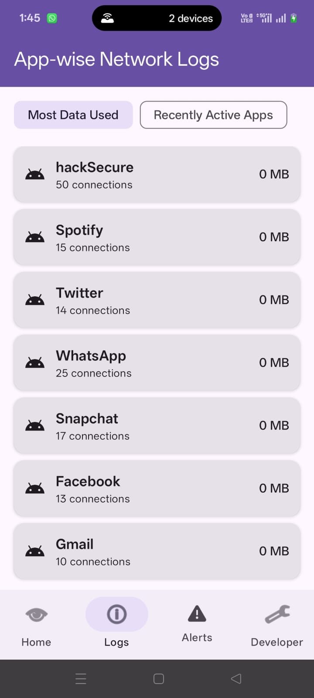

# 🔐 Lightweight Mobile Network Traffic Analyzer
### 🚀 HackSecure '26 | Team Atomic Engineers

A lightweight, privacy-focused Android application that monitors and analyzes app-level network traffic in real-time without requiring root access.

> ⚡ Built to expose hidden data flows and protect users from silent data exfiltration in everyday Android apps.

---

## 📌 Problem Statement

Most Android apps have internet access by default, allowing them to silently:
- Collect sensitive data (location, mic, camera)
- Send data to third-party trackers
- Operate even when marked as "offline"

🔍 Existing tools:
- Require **root access** (unsafe & impractical)
- Cannot effectively analyze **encrypted HTTPS traffic**
- Provide **limited visibility** to users

---

## 💡 Our Solution

We built a **VPN-based on-device traffic analyzer** that:
- Captures and inspects all outgoing app traffic
- Maps traffic to specific apps
- Detects suspicious connections using heuristic analysis
- Provides real-time alerts and controls

**Workflow**   

---

## ✨ Key Features

### 🔎 Network Monitoring
- Tracks all outgoing traffic (foreground + background)
- Detects connections to blacklisted IPs/domains

### 🚨 Smart Threat Detection
- Rule-based heuristic risk scoring engine
- Flags suspicious connections instantly

### 📊 App Security Dashboard
- 72-hour traffic history
- App-wise security scores
- Flagged events & alerts

### 🌐 Live Traffic Visualization
- Real-time network flow mapping (Tracker Web)
- Protocol-level insights (TCP/UDP/DNS)

### 🛑 App Control System
- One-tap connection blocking
- Per-app kill switch
- Future auto-block rules

### 👨‍👩‍👧 Parental Controls
- App blocking & network curfews
- DNS filtering for safe browsing

### 🔐 Permission Monitoring
- Tracks usage of camera, mic, location
- Flags suspicious behavior patterns

---

## 🏗️ Technical Architecture

### 📱 Frontend
- Jetpack Compose (Android Native UI)
- Material Design 3

### ⚙️ Backend (On-Device)
- Kotlin
- Android VPNService (for rootless traffic capture)

### 🗄️ Database
- Room Database (Encrypted)
- 72-hour metadata retention

### 🌐 Network Engine
- Packet Parsing (IP, TCP, UDP, DNS headers)
- Metadata extraction (no payload decryption)

### 🧠 Threat Detection
- Rule-based heuristic engine
- Traffic fingerprinting (pattern-based analysis)

### 🌍 Security Intelligence
- Local blacklist database
- GeoIP lookup & ASN mapping

### ⚡ Performance
- Kotlin Coroutines for concurrency
- Optimized packet handling for low battery usage

---

## ⚡ Key Innovations

- ✅ **Rootless Traffic Monitoring** using VPNService
- 🔒 **Privacy-First Design** (100% on-device processing)
- 🔍 **HTTPS Blindspot Bypass** using traffic fingerprinting
- 📉 **Low Resource Usage** (lightweight & battery-efficient)

---

## 🚧 Challenges & Solutions

| Challenge | Solution |
|----------|---------|
| No root access | Used Android VPNService for traffic interception |
| Encrypted HTTPS traffic | Used metadata + behavioral fingerprinting |
| False positives | Applied rule-based filtering & trusted domains |
| Performance overhead | Optimized Kotlin parsing + coroutines |

---

## 📊 Impact

According to our impact analysis (*page 5* :contentReference[oaicite:1]{index=1}):

- Detects "fake offline" apps secretly sending data
- Identifies hidden trackers and data brokers
- Reduces battery drain caused by background uploads
- Gives users **actionable security insights**

---

## 🔍 Competitive Advantage

| Feature | Default Android | Our App |
|--------|----------------|--------|
| Network visibility | Basic usage stats | Full traffic mapping |
| App control | On/Off only | Per-app control |
| Threat detection | Static | Behavior-based |
| Offline apps | Trusted blindly | Verified & flagged |

---

## 🛠️ Tech Stack

- Kotlin
- Android SDK
- Jetpack Compose
- Room Database
- VPNService API
- GeoIP Services
- Git & GitHub

---

## 🚀 Future Scope

- ML-based anomaly detection (advanced threat intelligence)
- Cloud-based threat intelligence sync
- Cross-device analytics dashboard
- Enterprise security integrations

---

## 📸 App Screenshots

| App Startup | Security Dashboard | Network Traffic Logs |
|------------|------------------|---------------------|
|  |  |  |

---

## 👥 Team Atomic Engineers

- **Ayush Ranjan** – Backend, Integration & Research  
- **Himanshu Gupta** – Database, Backend & Integration  
- **Garvi Dibas** – Backend & Frontend  
- **Parvinder Kaur** – Frontend & App Design  

  

  <em>Team Atomic Engineers at HackSecure '26, NIT Hamirpur </em>

---

## 🛡️ About HackSecure '26

HackSecure '26 was a cybersecurity-focused hackathon hosted at NIT Hamirpur, bringing together students and developers to solve real-world challenges in privacy, network security, and secure system design.

The event aligned with national cybersecurity initiatives and is supported under the **Information Security Education and Awareness (ISEA Phase-III Project)**  program by the **Ministry of Electronics and Information Technology (MeitY), Government of India** and aimed to promote cybersecurity awareness, innovation, and skill development among students. 

---

## ⭐ Acknowledgement

Project Built during **HackSecure '26 @ NIT Hamirpur**  
Team: *Atomic Engineers*

---

> 🔥 If you like this project, give it a star!
